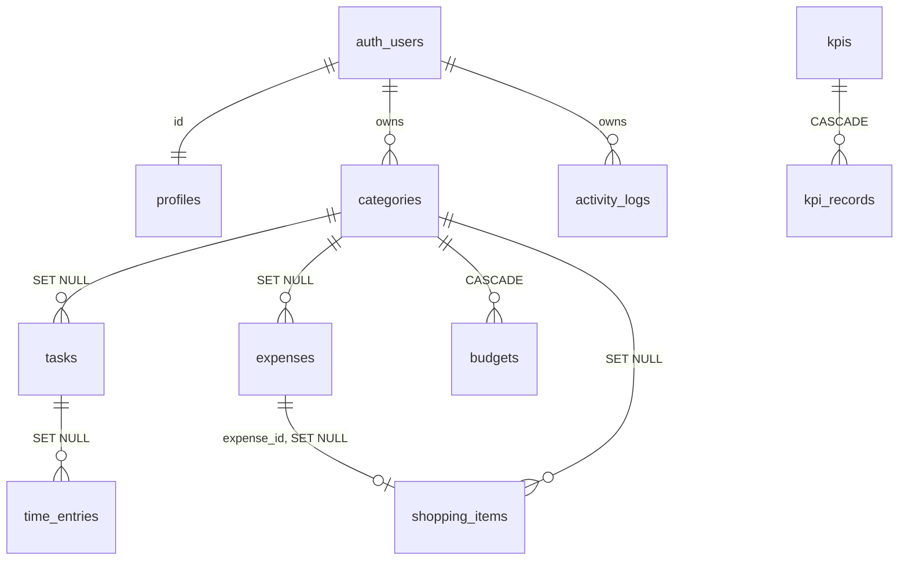

# Architecture — Personal Management Dashboard

> Trạng thái: **Phase 1** (kiến trúc + database). Chưa có UI.

## 1. Tổng quan

```
Browser (HTML/CSS/JS, Vite build)
   │  supabase-js  (anon key + JWT của user)
   ▼
Supabase: Auth · PostgREST · PostgreSQL + RLS
```

```
git push → GitHub Actions (check + build) → GitHub Pages (static) → Browser → Supabase
```

Không có server riêng. Toàn bộ "backend logic" nằm ở 3 chỗ:

| Loại logic | Nằm ở đâu |
|---|---|
| Phân quyền dữ liệu | RLS policies (`policies.sql`) |
| Toàn vẹn dữ liệu | CHECK / FK / unique index (`schema.sql`) |
| Dữ liệu dẫn xuất cần chính xác (completed_at, actual_minutes, KPI current_value, activity feed) | DB triggers (`schema.sql`) |

## 2. Quyết định công nghệ

| Hạng mục | Chọn | Lý do |
|---|---|---|
| Build | **Vite (vanilla JS, ES modules)** | Cần `VITE_*` env lúc build, bundle SDK từ npm thay vì CDN, có bước "build" thật cho CI. Không framework. |
| Dependencies runtime | `@supabase/supabase-js`, `chart.js` | Đúng 2 thứ. Icon = inline SVG, không thêm lib. |
| Dev dependency | `vite` | Duy nhất. |
| Routing | **Hash routing** (`#/tasks`) | GitHub Pages không có rewrite cho SPA → history routing sẽ 404 khi F5. |
| Auth flow | **PKCE** (`flowType: 'pkce'`) | Mặc định Supabase trả token trong URL fragment (`#access_token=…`) → đụng hash router. PKCE trả `?code=…` (query) nên không xung đột. |
| Style | CSS variables (design tokens), không CSS framework | Theo yêu cầu #27. |

## 3. Cấu trúc thư mục

Thay đổi so với đề bài: bỏ `src/js` (mơ hồ với `pages`/`components`), thay bằng `src/core`.

```
.github/workflows/deploy.yml     (Phase 14)
docs/ARCHITECTURE.md
public/                          favicon, static assets
supabase/
  schema.sql  policies.sql  seed.sql
src/
  main.js                        bootstrap: auth guard → router → shell
  css/    tokens.css base.css layout.css components.css
  core/   supabase.js router.js store.js (state + cache) config.js
  services/ auth.js tasks.js timeEntries.js expenses.js budgets.js
            shopping.js kpis.js categories.js activity.js reports.js
  components/ shell.js modal.js confirm.js toast.js chart.js empty-state.js …
  pages/  login.js dashboard.js tasks.js calendar.js time.js kpi.js
          expenses.js shopping.js reports.js settings.js
  utils/  format.js date.js dom.js debounce.js csv.js
index.html  .env.example  .gitignore  package.json  README.md
```

Quy tắc phụ thuộc: `pages → components/services → core/utils`. `services` là nơi DUY NHẤT gọi `supabase.from(...)`; page không đụng SDK.

## 4. Database



Mọi bảng dữ liệu có `user_id uuid default auth.uid()`.

### Quyết định thiết kế quan trọng

1. **Composite FK `(x_id, user_id) → parent(id, user_id)`.** FK bỏ qua RLS, nên FK thường cho phép user A gắn dữ liệu của mình vào task/category của user B nếu biết UUID. Composite FK chặn việc này ngay ở DB. (Đã có test.)
2. **`categories` là bảng riêng** (thêm so với danh sách tối thiểu): budget theo category, đổi tên category, category tùy chỉnh đều cần FK thật thay vì chuỗi. 14 category mặc định (9 chi tiêu theo spec + 5 task) được tạo tự động khi đăng ký.
3. **Timer = các "segment".** Pause = đóng segment, Resume = mở segment mới. Tổng thời gian chỉ là `SUM`, không có số học pause. Unique index đảm bảo mỗi user tối đa **một** timer đang chạy.
4. **`tasks.actual_minutes` là cache** của `SUM(time_entries)` do trigger duy trì; nguồn sự thật là `time_entries`. Muốn thêm giờ thủ công → tạo time entry `source='manual'`.
5. **`tasks.completed_at`** do trigger đặt/xóa khi đổi status — biểu đồ "task hoàn thành theo ngày" dựa vào cột này, client không tự set được sai.
6. **KPI record = snapshot giá trị thực tế tại một ngày** (không phải delta). `kpis.current_value` luôn = bản ghi mới nhất (trigger). Progress % = `current/target` tính ở client.
7. **Budget kiểu carry-forward:** một dòng nghĩa là "từ tháng này trở đi ngân sách là X". Ngân sách của tháng M = dòng có `effective_month` lớn nhất ≤ M. Đặt một lần dùng mãi, sửa tháng sau không làm đổi lịch sử. `category_id NULL` = ngân sách tổng.
8. **Shopping ≠ Expense.** Shopping là lớp kế hoạch; tiền chỉ được tính trong `expenses`. Khi "mua", UI có thể tạo expense và lưu `expense_id`. Dashboard **không cộng** shopping vào chi tiêu (tránh đếm đôi).
9. **`activity_logs` do trigger `SECURITY DEFINER` ghi**; client không có quyền INSERT. Ghi: task tạo/hoàn thành, expense mới, shopping tạo/đã mua, KPI cập nhật. Có `title` snapshot nên vẫn hiển thị đúng sau khi xóa bản gốc.
10. **Múi giờ:** `date` = ngày lịch của user; `timestamptz` = thời điểm thật. `profiles.timezone` (mặc định `Asia/Ho_Chi_Minh`) dùng để gom "theo ngày".

### Lệch so với đề bài (có chủ đích)

- `profiles` không có cột `user_id` riêng — `profiles.id` chính là user id.
- `activity_logs` không có `updated_at` — bảng append-only, bất biến.
- Tách `time_entries.task_id` nullable: cho phép tính giờ không gắn task.

## 5. Security model

- Frontend chỉ có `SUPABASE_URL` + `anon key`. **Anon key là public theo thiết kế** — dù bạn "không hard-code", nó vẫn nằm trong bundle JS gửi cho browser. An toàn đến từ RLS, không từ việc giấu key. Vì vậy repo public là ổn; `service_role` thì tuyệt đối không.
- 3 lớp: `GRANT` (role nào được thao tác gì) → RLS (hàng nào) → composite FK (tham chiếu chéo).
- `anon` (chưa đăng nhập) bị thu hồi toàn bộ quyền trên mọi bảng.
- Hàm helper/trigger bị `REVOKE EXECUTE` để không gọi được qua `/rest/v1/rpc/...`.
- `UPDATE` policy có cả `USING` và `WITH CHECK` → không thể đổi `user_id` sang người khác.
- Chưa có tính năng "xóa tài khoản" ở v1: cần `service_role` → phải dùng Edge Function. Để sau (đúng nguyên tắc #20).

## 6. Rủi ro / điểm cần biết trước khi triển khai

| Vấn đề | Hệ quả | Cách xử lý |
|---|---|---|
| Email xác nhận dùng SMTP mặc định của Supabase bị giới hạn rất thấp | Đăng ký/quên mật khẩu có thể không gửi được mail | Dùng cá nhân: tắt "Confirm email"; hoặc cấu hình SMTP riêng |
| Redirect URL | Reset password/confirm sẽ lỗi nếu URL Pages không nằm trong allow-list | Thêm `https://<user>.github.io/<repo>/` vào Auth → URL Configuration (hướng dẫn ở README, Phase 15) |
| GitHub Pages với **private** repo | Cần gói trả phí | Dùng repo public (an toàn vì không có secret trong source) |
| Supabase Free tự tạm dừng project nếu không hoạt động lâu | Mở app thấy lỗi kết nối | Dùng hằng ngày là đủ; vẫn nên có Export CSV làm backup (sẽ có ở Reports, Phase 10) |
| Calendar có trong sidebar nhưng spec không mô tả | Phạm vi mơ hồ | Đề xuất: lịch tháng/tuần hiển thị task theo `due_date` + time entries, **không thêm bảng**. Cần bạn xác nhận |

## 7. Kiểm chứng đã làm (Phase 1)

`schema.sql` + `policies.sql` (+ `seed.sql`) được chạy trên PostgreSQL thật (PGlite) với stub `auth.users` / `auth.uid()` / role `anon`, `authenticated`: **53 test pass** — gồm cô lập dữ liệu A/B trên cả 10 bảng, chặn tham chiếu chéo, trigger, constraint, `anon` bị từ chối, policies chạy lại được (idempotent), cascade khi xóa user.

Chưa kiểm chứng được: hành vi thật của Supabase Auth/PostgREST (cần project thật) — sẽ test ở Phase 2 khi bạn cung cấp URL + anon key.
